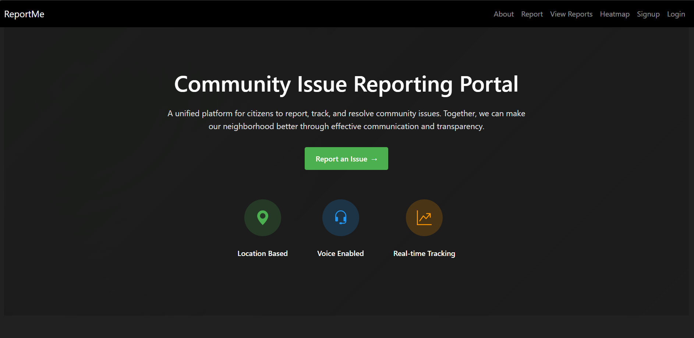
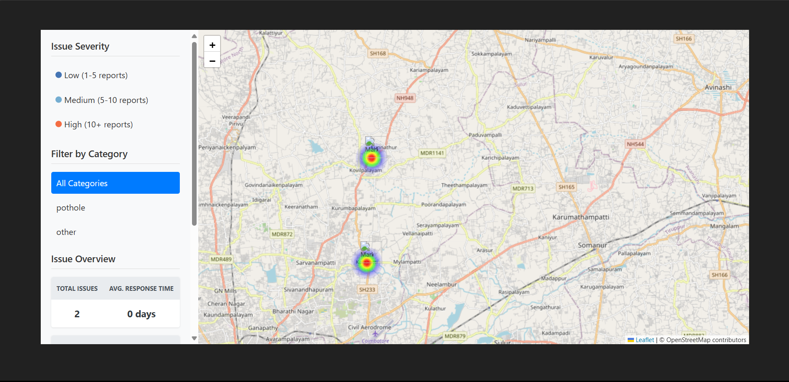
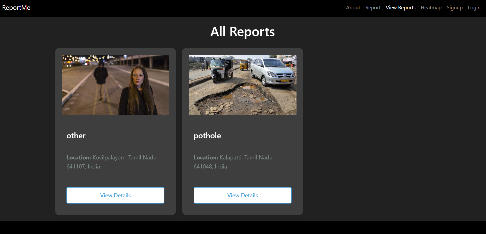
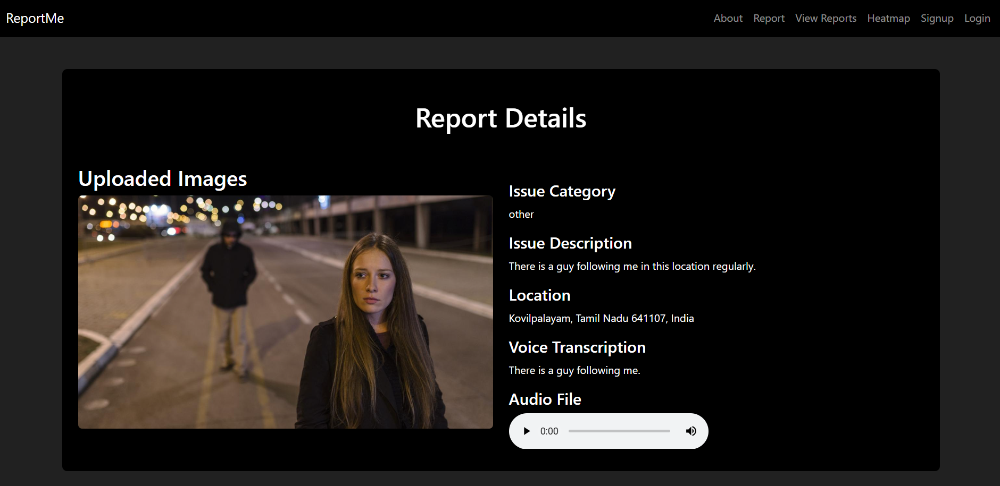
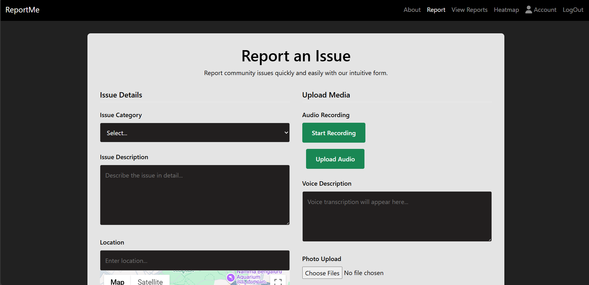
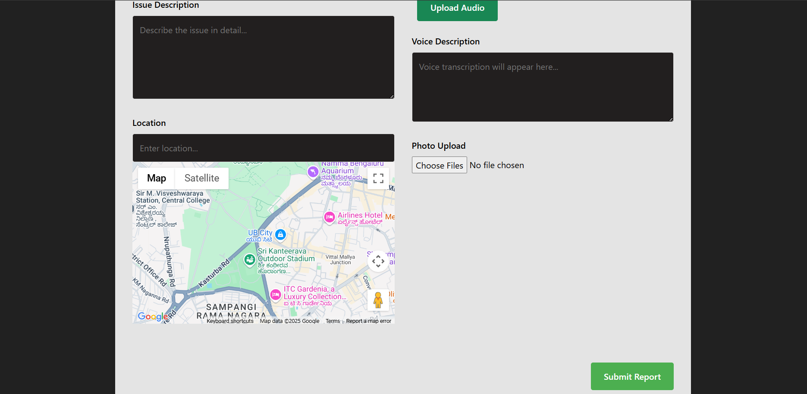

# 🗣️ ReportME - Complaint Registration Platform

A powerful platform built using **Node.js**, **Express.js**, and **MongoDB** that allows citizens to easily **register complaints** in their locality or society through **text** or **audio input**. Complaints are automatically transcribed using **Google Cloud Speech-to-Text API**, geotagged using **Google Maps API**, and visualized on a **heatmap** powered by **Leaflet.js + Heatmap.js**.

---

## 🚀 Features

- 🎙️ **Audio Complaint Support** – Speak your complaint, and we’ll transcribe it for you.
- ✍️ **Text-based Complaint Form** – Type in your issue with category and location.
- 🗺️ **Location Integration** – Uses Google Maps API to fetch exact user location.
- 🔥 **Heatmap Visualization** – View complaint density on a dynamic heatmap.
- 📂 **MongoDB Integration** – Fast and reliable database for storing complaint data.

---

## 🌐 Tech Stack

| Tech | Description |
|------|-------------|
| **Node.js** | Backend runtime |
| **Express.js** | Web framework for Node |
| **MongoDB** | NoSQL database |
| **Google Speech-to-Text API** | Converts audio complaints into text |
| **Google Maps API** | Fetches geolocation of user |
| **Leaflet.js** + **Heatmap.js** | Displays complaints in a heatmap format |
| **HTML/CSS/JavaScript** | Frontend for user interaction |

---

## 📸 Screenshots

<p align="center">
  
  
  
  
  
  
</p>

---

## 🔧 Installation

```bash
# Clone the repo
git clone https://github.com/adithyakrishnapn/Reportme.git
cd Reportme

# Install dependencies frontend
cd frontend
npm install
npm start

# Install dependencies backend
cd backend
npm install
npm start

# Setup environment variables
touch .env
contact me to get the .env file
